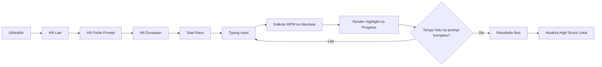

# Henrique Rapido

**Jogu Type Race atu treina velocidade, akurasia, no konsentrasaun hakerek iha browser.**

Henrique Rapido mak aplikasaun web simples ne'ebe harii ho HTML, CSS, no JavaScript vanilla. Jogu ida-ne'e ajuda utilizador treina typing ho prompt random, suporta lian English, Indonesia, no Tetun, hatudu WPM no akurasia iha tempu real, no rai high score lokal iha browser.


---

## Kona-ba Projetu

Henrique Rapido dezenvolve hodi fo esperiénsia typing race ne'ebe diretu, leve, no fasil atu uza. Utilizadór bele hili durasaun, hili lian, hili fonte prompt, depois hahu typing. Sistema kalkula WPM, akurasia, progress, karakter loos, karakter sala, no rezultadu ikus ho maneira automatiku.

Projetu ida-ne'e la presiza backend, login, database, ka framework. Aplikasaun bele loke diretamente husi `index.html` iha browser modernu.

## Objetivu

- Treina velocidade hakerek ho feedback iha tempu real.
- Ajuda utilizador haree akurasia no progress durante race.
- Fó prompt ne'ebe la repetitivu liu husi generator lokal.
- Suporta prompt internet random husi Wikipedia bainhira koneksaun internet iha.
- Manten aplikasaun simples atu developer foun bele aprende estrutura HTML, CSS, no JavaScript.

## Teknolojia ne'ebe Uza

| Kategoria | Teknolojia | Funsaun iha Sistema |
| --- | --- | --- |
| Estrutura | HTML5 | Markup ba layout jogu, kontrolu, prompt, input, no resultadu |
| Estilu | CSS3 | UI responsivu, grid, badge, state visual, no highlight karakter |
| Lojika | JavaScript ES6+ | State game, timer, typing input, kalkulasaun WPM, akurasia, no progress |
| Rai Dadus Lokal | LocalStorage | Rai high score iha browser utilizador |
| Prompt Internet | Wikipedia REST API | Foti random summary tuir lian ne'ebe utilizador hili |
| Prompt Lokal | Word Bank Generator | Kria prompt random husi kombinasaun liafuan unik |
| Build | La iha build step | Aplikasaun halai diretamente iha browser |

## Funsaun Prinsipál

### Type Race

- Hahu race ho butaun `Start`.
- Restart race iha tempu running ka depois race remata.
- Timer suporta durasaun `30s`, `60s`, no `120s`.
- Race remata bainhira tempu hotu ka utilizador kompleta prompt.

### Prompt Multilingua

- Suporta lian `English`, `Indonesia`, no `Tetun`.
- Utilizadór bele hili prompt source:
  - `Local random`
  - `Internet random`
- Prompt lokal uza word bank atu kria kombinasaun frase ne'ebe diferente.
- Prompt internet uza random summary husi Wikipedia tuir lian:
  - `en.wikipedia.org`
  - `id.wikipedia.org`
  - `tet.wikipedia.org`
- Se internet/API falla, sistema fallback ba prompt lokal.
- Prompt hotu mosu iha forma simples: huruf biasa, espasu, koma, no pontu de'it.
- Sistema hamoos numeru, simbolu, dash, apostrophe, no letra ho sinal iha leten atu typing la sai todan.

### Estatistika Real-time

- WPM kalkula husi karakter loos.
- Akurásia kalkula husi karakter loos kompara ho total karakter ne'ebe utilizador hakerek.
- Progress bar hatudu persentajen prompt ne'ebe remata ona.
- Resultadu hatudu:
  - WPM ikus
  - Akurásia ikus
  - Karakter loos
  - Karakter sala
  - Total karakter hakerek
  - Durasaun race

### Highlight Karakter

- Karakter loos hetan estilu `correct`.
- Karakter sala hetan estilu `incorrect`.
- Karakter atual hetan estilu `current`.
- Karakter seidauk hakerek hela neutral.

### High Score Lokal

- High score rai iha `localStorage`.
- Key ne'ebe uza:

```text
type-race-high-score
```

- Skor foun sai high score se WPM aas liu.
- Se WPM hanesan, akurasia aas liu mak manán.
- Se WPM no akurasia hanesan, durasaun naruk liu mak manán.

### Proteksaun Paste

- Durante race running, paste ba typing input sei blokeadu.
- Objetivu mak atu race ne'e baseia ba typing rasik, la'ós copy-paste.

## Fluxu Sistema



## Estrutura Projetu

```text
Henrique-Rapido/
|-- index.html              # Puntu entrada aplikasaun
|-- README.md               # Dokumentasaun projetu
|-- prd.md                  # Dokumentu rekizitu produtu
|-- src/
|   |-- app.js              # State game, eventu, timer, WPM, akurasia, no render
|   |-- storage.js          # LocalStorage helper ba high score
|   `-- texts.js            # Prompt generator lokal no Wikipedia random prompt
`-- styles/
    `-- main.css            # UI, layout responsivu, no highlight karakter
```

## Oinsá Halai iha Lokal

### 1. Clone Projetu

```bash
git clone https://github.com/herciomoreira3/Henrique-Rapido.git
cd Henrique-Rapido
```

### 2. Loke iha Browser

Loke file ida-ne'e diretamente:

```text
index.html
```

Ka uza server static simples se hakarak asesu liu husi localhost:

```bash
python -m http.server 8080
```

Depois loke:

```text
http://localhost:8080
```

## Oinsá Uza

1. Hili `Language`.
2. Hili `Source`.
3. Hili `Duration`.
4. Klik `Start`.
5. Hakerek prompt ne'ebe mosu iha layar.
6. Haree WPM, akurasia, no progress durante race.
7. Bainhira race remata, haree rezultadu ikus.
8. Klik `Restart` atu hahu race foun.

## Konfigurasaun Lian no Fonte

| Opsaun | Deskrisaun |
| --- | --- |
| English | Prompt iha lian English |
| Indonesia | Prompt iha lian Indonesia |
| Tetun | Prompt iha lian Tetun |
| Local random | Prompt husi word bank lokal ne'ebe kombinadu random |
| Internet random | Prompt husi Wikipedia random summary |

## Testing no Verifikasaun

### Verifikasaun Syntax

```bash
node --check src/app.js
node --check src/storage.js
node --check src/texts.js
```

### Test Manual

- Loke `index.html` iha browser.
- Hili `English`, `Indonesia`, no `Tetun`, depois klik `Start`.
- Troka source ba `Internet random`, depois haree badge source iha prompt panel.
- Ketik karakter loos no sala atu haree highlight.
- Pastikan WPM, akurasia, no progress muda durante typing.
- Coba paste durante race; input labele simu paste.
- Remata race no refresh browser; high score tenke nafatin mosu.

## Nota ba Prompt Internet

Mode `Internet random` depende ba koneksaun internet no disponibilidade Wikipedia REST API. Se koneksaun falla, API blokadu, ka summary kurta liu, aplikasaun sei uza `Local fallback` atu race bele kontinua.

## Seguransa no Privasidade

- Aplikasaun la iha login.
- Aplikasaun la haruka skor utilizador ba server.
- High score rai de'it iha browser utilizador.
- Prompt internet foti de'it konteúdu random husi Wikipedia public API.
- Paste blokeadu de'it durante race running.

## Etiketa

`html5` `css3` `javascript` `vanilla-js` `typing-game` `type-race` `wpm` `accuracy` `localstorage` `wikipedia-api` `tetun` `indonesia` `english` `responsive-design`

## Planu Oin

- Tema dark mode.
- Lista prompt offline ne'ebe boot liu ba Tetun.
- Sound effect ne'ebe bele ativa ka desativa.
- Estatistika historiku ba race ikus.
- Export high score ba JSON.
- Mode custom prompt husi utilizador.

## Lisensa

Projetu ida-ne'e uza lisensa MIT.

---

**Henrique Rapido** - Jogu typing race simples, leve, no multilingual atu treina velocidade no akurasia hakerek.
